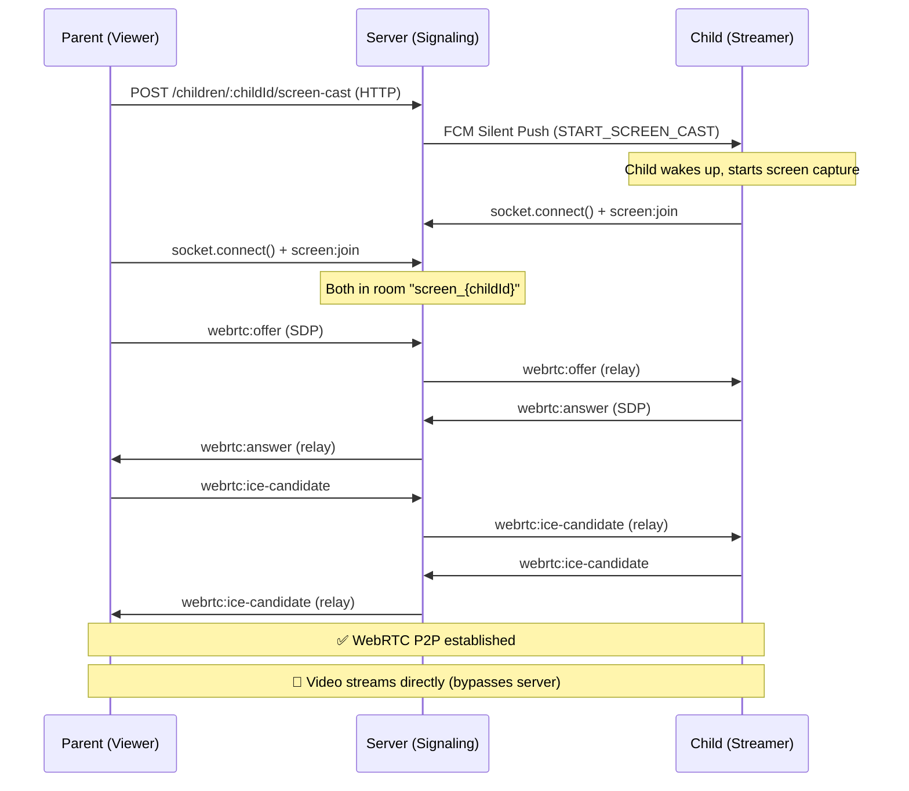

# 📡 Screencast WebSocket API Documentation

## Overview

The Screencast feature allows a **Parent** to view a **Child's** device screen in real-time. It uses **WebRTC** for peer-to-peer video streaming, with **Socket.IO** as the signaling server to exchange connection metadata (SDP offers/answers and ICE candidates). The actual video stream **never passes through the server** — it flows directly between the child and parent devices.



---

## 1. Authentication

### Socket.IO Connection

All WebSocket connections require a **JWT token**. Pass it in the `auth` object during connection:

```
URL: ws://your-server:5000
Auth: { token: "eyJhbGciOiJIUzI1NiI..." }
```

The server validates the token via the `socketAuthMiddleware`. On success, `socket.data.user` is populated with the decoded JWT payload (`IJwtPayload`).

> **Important:** Both Parent and Child tokens are supported. The `role` field determines the user type.

---

## 2. HTTP Endpoint — Request Screencast

Before the WebSocket signaling begins, the parent triggers a screen cast request via HTTP. This sends an FCM silent push to wake up the child's device.

| Field | Value |
|-------|-------|
| **Method** | `POST` |
| **URL** | `/api/v1/children/:childId/screen-cast` |
| **Auth** | Bearer Token (Parent JWT) |
| **Params** | `childId` — MongoDB ObjectId of the child |

**Response (200 OK):**
```json
{
  "success": true,
  "status": "success",
  "message": "Screen share requested. Waiting for device connection..."
}
```

**FCM Payload sent to child device:**
```json
{
  "action": "START_SCREEN_CAST",
  "roomId": "screen_6a0088a2d9febfcd730a6452",
  "timestamp": "2026-05-10T14:00:00.000Z"
}
```

---

## 3. Socket Events Reference

### Client → Server Events

| Event | Payload | Description |
|-------|---------|-------------|
| `screen:join` | `{ childId: string }` | Join the signaling room `screen_{childId}`. Both parent and child emit this. |
| `screen:leave` | `{ childId: string }` | Leave the signaling room. Triggers `screen:ended` to remaining peers. |
| `webrtc:offer` | `{ childId: string, sdp: RTCSessionDescriptionInit }` | Send SDP offer. Typically sent by the **parent** (viewer). |
| `webrtc:answer` | `{ childId: string, sdp: RTCSessionDescriptionInit }` | Send SDP answer. Typically sent by the **child** (streamer). |
| `webrtc:ice-candidate` | `{ childId: string, candidate: RTCIceCandidateInit }` | Send ICE candidate. Both sides send these. |

### Server → Client Events

| Event | Payload | Description |
|-------|---------|-------------|
| `screen:user-joined` | `{ role: "PARENT"\|"CHILD", userId: string }` | Notifies when another user joins the room. |
| `screen:ended` | _(none)_ | Notifies that the screen share session has ended. |
| `webrtc:offer` | `{ sdp: RTCSessionDescriptionInit }` | Relayed SDP offer (no `childId` — already scoped to room). |
| `webrtc:answer` | `{ sdp: RTCSessionDescriptionInit }` | Relayed SDP answer. |
| `webrtc:ice-candidate` | `{ candidate: RTCIceCandidateInit }` | Relayed ICE candidate. |
| `screen:error` | `string` | Error message from the server. |

### Type Definitions

```typescript
interface RTCSessionDescriptionInit {
  type: "offer" | "answer";
  sdp: string;           // SDP string (Session Description Protocol)
}

interface RTCIceCandidateInit {
  candidate: string;     // ICE candidate string
  sdpMid?: string;       // Media stream identification tag
  sdpMLineIndex?: number; // Index of the media description
}
```

---

## 4. Apidog / Postman Testing

### Step 1: Connect Socket.IO

In Apidog's Socket.IO panel:

| Field | Value |
|-------|-------|
| URL | `http://localhost:5000` |
| Auth | Handshake params → `auth.token = <JWT>` |

### Step 2: Emit Events

**Join Room:**
```json
Event: "screen:join"
Data: { "childId": "6a0088a2d9febfcd730a6452" }
```

**Send Offer (as Parent):**
```json
Event: "webrtc:offer"
Data: {
  "childId": "6a0088a2d9febfcd730a6452",
  "sdp": {
    "type": "offer",
    "sdp": "v=0\r\no=- 123456 2 IN IP4 127.0.0.1\r\n..."
  }
}
```

**Send Answer (as Child):**
```json
Event: "webrtc:answer"
Data: {
  "childId": "6a0088a2d9febfcd730a6452",
  "sdp": {
    "type": "answer",
    "sdp": "v=0\r\no=- 789012 2 IN IP4 127.0.0.1\r\n..."
  }
}
```

**Send ICE Candidate:**
```json
Event: "webrtc:ice-candidate"
Data: {
  "childId": "6a0088a2d9febfcd730a6452",
  "candidate": {
    "candidate": "candidate:1 1 UDP 2130706431 192.168.1.10 54321 typ host",
    "sdpMid": "0",
    "sdpMLineIndex": 0
  }
}
```

### Step 3: Listen for Events

Subscribe to: `screen:user-joined`, `webrtc:offer`, `webrtc:answer`, `webrtc:ice-candidate`, `screen:ended`, `screen:error`

---

## 5. Kotlin — Child Streamer (Android)

> Requires: `io.socket:socket.io-client`, `org.webrtc:google-webrtc`

```kotlin
import io.socket.client.IO
import io.socket.client.Socket
import org.json.JSONObject
import org.webrtc.*

class ScreenCastService(
    private val serverUrl: String,
    private val token: String,
    private val childId: String,
) {
    private lateinit var socket: Socket
    private var peerConnection: PeerConnection? = null
    private var localStream: MediaStream? = null
    private val pendingCandidates = mutableListOf<IceCandidate>()

    private val iceServers = listOf(
        PeerConnection.IceServer.builder("stun:stun.l.google.com:19302").createIceServer()
    )

    // ── 1. Connect to signaling server ──────────────────────────────────
    fun connect() {
        val options = IO.Options().apply {
            auth = mapOf("token" to token)
        }

        socket = IO.socket(serverUrl, options)

        socket.on(Socket.EVENT_CONNECT) {
            log("Socket connected: ${socket.id()}")
            // Join the screen room
            socket.emit("screen:join", JSONObject().put("childId", childId))
        }

        // Listen for WebRTC offer from parent
        socket.on("webrtc:offer") { args ->
            val payload = args[0] as JSONObject
            val sdpJson = payload.getJSONObject("sdp")
            handleOffer(sdpJson)
        }

        // Listen for ICE candidates from parent
        socket.on("webrtc:ice-candidate") { args ->
            val payload = args[0] as JSONObject
            val candidateJson = payload.getJSONObject("candidate")
            handleIceCandidate(candidateJson)
        }

        socket.on("screen:ended") {
            log("Screen share ended by remote")
            closePeerConnection()
        }

        socket.connect()
    }

    // ── 2. Start screen capture ─────────────────────────────────────────
    // Call this after MediaProjection is granted by the system
    fun startCapture(videoCapturer: VideoCapturer, factory: PeerConnectionFactory) {
        val videoSource = factory.createVideoSource(videoCapturer.isScreencast)
        videoCapturer.initialize(
            SurfaceTextureHelper.create("CaptureThread", EglBase.create().eglBaseContext),
            /* context */ null,
            videoSource.capturerObserver
        )
        videoCapturer.startCapture(1280, 720, 30)

        val videoTrack = factory.createVideoTrack("screen_track", videoSource)
        localStream = factory.createLocalMediaStream("screen_stream").apply {
            addTrack(videoTrack)
        }
        log("Screen capture started — waiting for parent offer")
    }

    // ── 3. Handle WebRTC offer from parent ──────────────────────────────
    private fun handleOffer(sdpJson: JSONObject) {
        log("Received WebRTC offer from parent")
        val stream = localStream ?: run {
            log("ERROR: No screen capture active")
            return
        }

        peerConnection = createPeerConnection()

        // Add screen capture tracks
        stream.videoTracks.forEach { track ->
            peerConnection?.addTrack(track, listOf("screen_stream"))
        }

        // Set remote description (the offer)
        val offer = SessionDescription(
            SessionDescription.Type.OFFER,
            sdpJson.getString("sdp")
        )
        peerConnection?.setRemoteDescription(SimpleSdpObserver(), offer)

        // Flush buffered ICE candidates
        pendingCandidates.forEach { peerConnection?.addIceCandidate(it) }
        pendingCandidates.clear()

        // Create and send answer
        peerConnection?.createAnswer(object : SimpleSdpObserver() {
            override fun onCreateSuccess(desc: SessionDescription) {
                peerConnection?.setLocalDescription(SimpleSdpObserver(), desc)
                val answerPayload = JSONObject().apply {
                    put("childId", childId)
                    put("sdp", JSONObject().apply {
                        put("type", "answer")
                        put("sdp", desc.description)
                    })
                }
                socket.emit("webrtc:answer", answerPayload)
                log("Sent WebRTC answer")
            }
        }, MediaConstraints())
    }

    // ── 4. Handle ICE candidates ────────────────────────────────────────
    private fun handleIceCandidate(json: JSONObject) {
        val candidate = IceCandidate(
            json.optString("sdpMid", ""),
            json.optInt("sdpMLineIndex", 0),
            json.getString("candidate")
        )

        if (peerConnection?.remoteDescription != null) {
            peerConnection?.addIceCandidate(candidate)
        } else {
            pendingCandidates.add(candidate) // Buffer until remote desc is set
        }
    }

    // ── 5. Create peer connection ───────────────────────────────────────
    private fun createPeerConnection(): PeerConnection {
        val config = PeerConnection.RTCConfiguration(iceServers)
        return PeerConnectionFactory.builder().createPeerConnectionFactory()
            .createPeerConnection(config, object : PeerConnection.Observer {
                override fun onIceCandidate(candidate: IceCandidate) {
                    val payload = JSONObject().apply {
                        put("childId", childId)
                        put("candidate", JSONObject().apply {
                            put("candidate", candidate.sdp)
                            put("sdpMid", candidate.sdpMid)
                            put("sdpMLineIndex", candidate.sdpMLineIndex)
                        })
                    }
                    socket.emit("webrtc:ice-candidate", payload)
                }

                override fun onIceConnectionChange(state: PeerConnection.IceConnectionState) {
                    log("ICE state: $state")
                }

                // ... other required overrides (no-op)
                override fun onSignalingChange(s: PeerConnection.SignalingState) {}
                override fun onIceConnectionReceivingChange(b: Boolean) {}
                override fun onIceGatheringChange(s: PeerConnection.IceGatheringState) {}
                override fun onAddStream(s: MediaStream) {}
                override fun onRemoveStream(s: MediaStream) {}
                override fun onDataChannel(dc: DataChannel) {}
                override fun onRenegotiationNeeded() {}
            })!!
    }

    fun disconnect() {
        socket.emit("screen:leave", JSONObject().put("childId", childId))
        closePeerConnection()
        socket.disconnect()
    }

    private fun closePeerConnection() {
        peerConnection?.close()
        peerConnection = null
        pendingCandidates.clear()
    }

    private fun log(msg: String) = println("[ScreenCast] $msg")
}
```

**Usage in an Android Service/Activity:**
```kotlin
val screenCast = ScreenCastService(
    serverUrl = "http://your-server:5000",
    token = childJwtToken,
    childId = "6a0088a2d9febfcd730a6452"
)
screenCast.connect()

// After MediaProjection permission is granted:
val capturer = ScreenCapturerAndroid(mediaProjectionData, object : MediaProjection.Callback() {})
screenCast.startCapture(capturer, peerConnectionFactory)
```

---

## 6. Flutter — Parent Viewer

> Requires: `socket_io_client`, `flutter_webrtc`

```dart
import 'package:flutter_webrtc/flutter_webrtc.dart';
import 'package:socket_io_client/socket_io_client.dart' as io;

class ScreenCastViewer {
  late io.Socket socket;
  RTCPeerConnection? peerConnection;
  final RTCVideoRenderer remoteRenderer = RTCVideoRenderer();
  final String serverUrl;
  final String token;
  final String childId;
  final List<RTCIceCandidate> _pendingCandidates = [];

  ScreenCastViewer({
    required this.serverUrl,
    required this.token,
    required this.childId,
  });

  final Map<String, dynamic> _iceServers = {
    'iceServers': [
      {'urls': 'stun:stun.l.google.com:19302'},
    ]
  };

  // ── 1. Initialize ─────────────────────────────────────────────────
  Future<void> init() async {
    await remoteRenderer.initialize();
  }

  // ── 2. Connect to signaling server ────────────────────────────────
  void connect() {
    socket = io.io(serverUrl, <String, dynamic>{
      'auth': {'token': token},
      'transports': ['polling', 'websocket'],
    });

    socket.onConnect((_) {
      print('Socket connected: ${socket.id}');
      socket.emit('screen:join', {'childId': childId});
    });

    // Listen for WebRTC answer from child
    socket.on('webrtc:answer', (data) async {
      print('Received WebRTC answer');
      final sdp = data['sdp'];
      await peerConnection?.setRemoteDescription(
        RTCSessionDescription(sdp['sdp'], sdp['type']),
      );

      // Flush buffered ICE candidates
      for (final candidate in _pendingCandidates) {
        await peerConnection?.addCandidate(candidate);
      }
      _pendingCandidates.clear();
    });

    // Listen for ICE candidates from child
    socket.on('webrtc:ice-candidate', (data) async {
      final c = data['candidate'];
      final candidate = RTCIceCandidate(
        c['candidate'],
        c['sdpMid'],
        c['sdpMLineIndex'],
      );

      if (peerConnection?.getRemoteDescription() != null) {
        await peerConnection?.addCandidate(candidate);
      } else {
        _pendingCandidates.add(candidate);
      }
    });

    socket.on('screen:user-joined', (data) {
      print('User joined: ${data['role']} (${data['userId']})');
    });

    socket.on('screen:ended', (_) {
      print('Screen share ended');
      _closePeerConnection();
    });

    socket.connect();
  }

  // ── 3. Start watching (create offer) ──────────────────────────────
  Future<void> startWatching() async {
    peerConnection = await createPeerConnection(_iceServers);

    // Add recvonly transceiver for video
    await peerConnection!.addTransceiver(
      kind: RTCRtpMediaType.RTCRtpMediaTypeVideo,
      init: RTCRtpTransceiverInit(direction: TransceiverDirection.RecvOnly),
    );

    // Handle ICE candidates
    peerConnection!.onIceCandidate = (candidate) {
      socket.emit('webrtc:ice-candidate', {
        'childId': childId,
        'candidate': candidate.toMap(),
      });
    };

    // Handle remote stream
    peerConnection!.onTrack = (event) {
      print('Received remote track: ${event.track.kind}');
      if (event.streams.isNotEmpty) {
        remoteRenderer.srcObject = event.streams[0];
      }
    };

    peerConnection!.onIceConnectionState = (state) {
      print('ICE state: $state');
    };

    // Create and send offer
    final offer = await peerConnection!.createOffer();
    await peerConnection!.setLocalDescription(offer);

    socket.emit('webrtc:offer', {
      'childId': childId,
      'sdp': {'type': offer.type, 'sdp': offer.sdp},
    });
    print('Sent WebRTC offer');
  }

  // ── 4. Cleanup ────────────────────────────────────────────────────
  void stopWatching() {
    _closePeerConnection();
    socket.emit('screen:leave', {'childId': childId});
    socket.emit('screen:join', {'childId': childId}); // Stay for re-negotiation
  }

  void _closePeerConnection() {
    peerConnection?.close();
    peerConnection = null;
    _pendingCandidates.clear();
    remoteRenderer.srcObject = null;
  }

  void dispose() {
    socket.emit('screen:leave', {'childId': childId});
    _closePeerConnection();
    remoteRenderer.dispose();
    socket.disconnect();
  }
}
```

**Usage in a Flutter Widget:**
```dart
class ScreenCastPage extends StatefulWidget { ... }

class _ScreenCastPageState extends State<ScreenCastPage> {
  late ScreenCastViewer viewer;

  @override
  void initState() {
    super.initState();
    viewer = ScreenCastViewer(
      serverUrl: 'http://your-server:5000',
      token: parentJwtToken,
      childId: '6a0088a2d9febfcd730a6452',
    );
    viewer.init().then((_) => viewer.connect());
  }

  @override
  Widget build(BuildContext context) {
    return Scaffold(
      body: RTCVideoView(viewer.remoteRenderer),
      floatingActionButton: FloatingActionButton(
        onPressed: () => viewer.startWatching(),
        child: Icon(Icons.play_arrow),
      ),
    );
  }

  @override
  void dispose() {
    viewer.dispose();
    super.dispose();
  }
}
```

---

## 7. Next.js — Parent Viewer (Web)

> Requires: `socket.io-client` (`npm i socket.io-client`)

```tsx
// app/screencast/[childId]/page.tsx
'use client';

import { useCallback, useEffect, useRef, useState } from 'react';
import { io, Socket } from 'socket.io-client';

const ICE_SERVERS = [{ urls: 'stun:stun.l.google.com:19302' }];

interface RTCSdp {
  type: 'offer' | 'answer';
  sdp: string;
}

interface RTCCandidate {
  candidate: string;
  sdpMid?: string;
  sdpMLineIndex?: number;
}

export default function ScreenCastPage({
  params,
}: {
  params: { childId: string };
}) {
  const { childId } = params;
  const videoRef = useRef<HTMLVideoElement>(null);
  const socketRef = useRef<Socket | null>(null);
  const pcRef = useRef<RTCPeerConnection | null>(null);
  const pendingCandidatesRef = useRef<RTCIceCandidateInit[]>([]);

  const [status, setStatus] = useState<
    'disconnected' | 'connected' | 'viewing'
  >('disconnected');

  // ── 1. Connect to signaling server ────────────────────────────────
  useEffect(() => {
    const token = localStorage.getItem('accessToken');
    if (!token) return;

    const socket = io(process.env.NEXT_PUBLIC_API_URL!, {
      auth: { token },
    });

    socketRef.current = socket;

    socket.on('connect', () => {
      console.log('Socket connected:', socket.id);
      socket.emit('screen:join', { childId });
      setStatus('connected');
    });

    socket.on('disconnect', () => setStatus('disconnected'));

    // ── WebRTC answer from child ──
    socket.on('webrtc:answer', async (payload: { sdp: RTCSdp }) => {
      const pc = pcRef.current;
      if (!pc) return;

      await pc.setRemoteDescription(payload.sdp);

      // Flush buffered ICE candidates
      for (const candidate of pendingCandidatesRef.current) {
        await pc.addIceCandidate(candidate);
      }
      pendingCandidatesRef.current = [];
    });

    // ── ICE candidates from child ──
    socket.on(
      'webrtc:ice-candidate',
      async (payload: { candidate: RTCCandidate }) => {
        const pc = pcRef.current;
        if (pc?.remoteDescription) {
          await pc.addIceCandidate(payload.candidate);
        } else {
          pendingCandidatesRef.current.push(payload.candidate);
        }
      },
    );

    socket.on('screen:ended', () => {
      pcRef.current?.close();
      pcRef.current = null;
      if (videoRef.current) videoRef.current.srcObject = null;
      setStatus('connected');
    });

    return () => {
      socket.emit('screen:leave', { childId });
      socket.disconnect();
      pcRef.current?.close();
    };
  }, [childId]);

  // ── 2. Start watching ─────────────────────────────────────────────
  const startWatching = useCallback(async () => {
    const socket = socketRef.current;
    if (!socket) return;

    pendingCandidatesRef.current = [];
    const pc = new RTCPeerConnection({ iceServers: ICE_SERVERS });
    pcRef.current = pc;

    // Receive-only video
    pc.addTransceiver('video', { direction: 'recvonly' });

    pc.onicecandidate = (e) => {
      if (e.candidate) {
        socket.emit('webrtc:ice-candidate', {
          childId,
          candidate: e.candidate.toJSON(),
        });
      }
    };

    pc.ontrack = (e) => {
      if (videoRef.current) {
        videoRef.current.srcObject =
          e.streams[0] ?? new MediaStream([e.track]);
      }
    };

    pc.oniceconnectionstatechange = () => {
      if (pc.iceConnectionState === 'connected') setStatus('viewing');
      if (pc.iceConnectionState === 'failed') setStatus('connected');
    };

    const offer = await pc.createOffer();
    await pc.setLocalDescription(offer);

    socket.emit('webrtc:offer', {
      childId,
      sdp: pc.localDescription,
    });
  }, [childId]);

  // ── 3. Render ─────────────────────────────────────────────────────
  return (
    <div>
      <h1>Screen Cast — Child {childId}</h1>
      <p>Status: {status}</p>
      <video ref={videoRef} autoPlay playsInline style={{ width: '100%' }} />
      <button onClick={startWatching} disabled={status !== 'connected'}>
        Start Watching
      </button>
    </div>
  );
}
```

---

## 8. Error Handling

| Scenario | What Happens |
|----------|-------------|
| Invalid/expired JWT | Socket connection rejected with `Authentication error` |
| Child not found or unauthorized | HTTP 403 on `POST /screen-cast` |
| Child device offline | HTTP 400 — `Child device is offline or not paired` |
| WebRTC connection fails | ICE state → `failed`. Retry by calling `startWatching()` again |
| Socket disconnects mid-stream | `disconnect` event fires. WebRTC may survive briefly on P2P, then `iceConnectionState` → `disconnected` |

## 9. ICE Candidate Buffering (Important!)

> **Warning:** ICE candidates often arrive **before** the remote SDP description is set. You **MUST** buffer them and flush after `setRemoteDescription()` succeeds. Dropping early candidates will cause WebRTC connection failures.

```
// Pseudocode — applies to ALL platforms
on("webrtc:ice-candidate"):
    if peerConnection.remoteDescription exists:
        peerConnection.addIceCandidate(candidate)
    else:
        pendingCandidates.push(candidate)  // Buffer!

on("webrtc:answer" or "webrtc:offer"):
    peerConnection.setRemoteDescription(sdp)
    for each candidate in pendingCandidates:
        peerConnection.addIceCandidate(candidate)
    pendingCandidates.clear()
```
